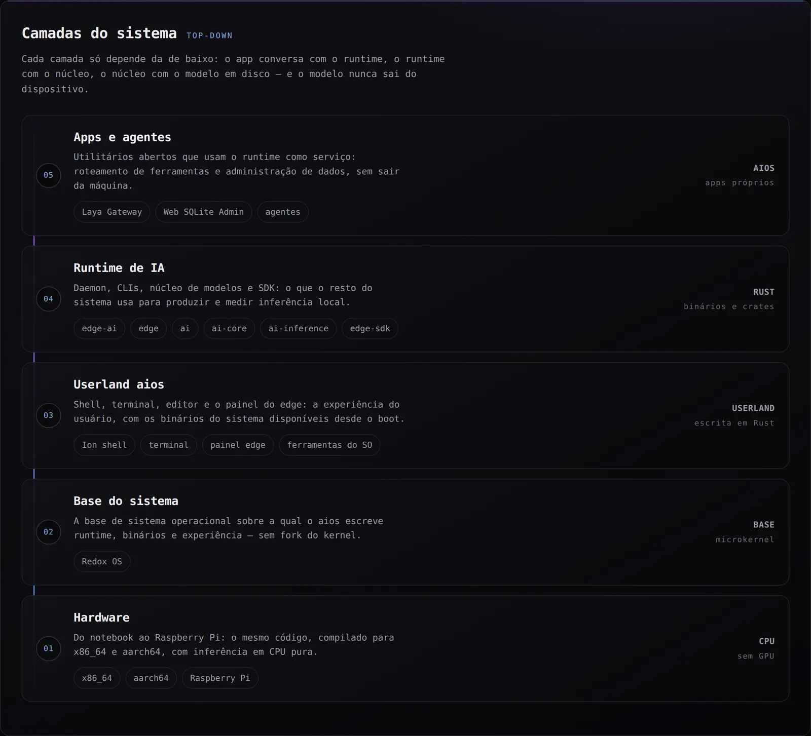
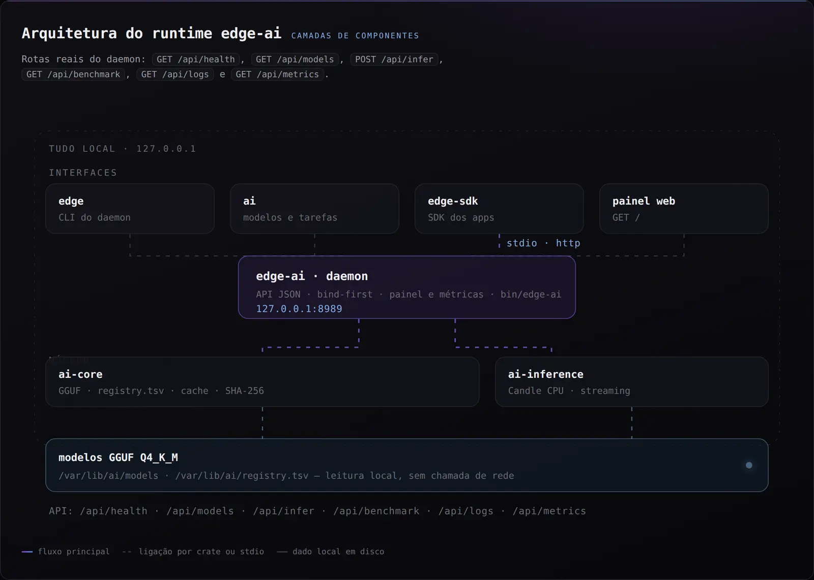
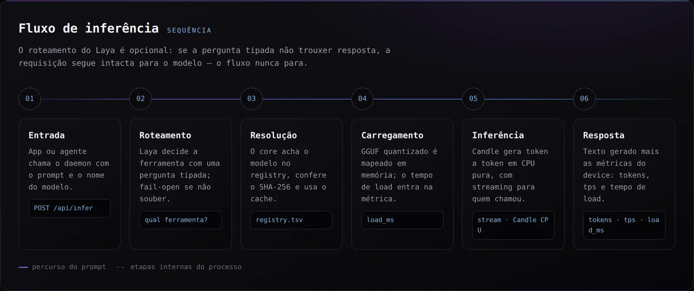
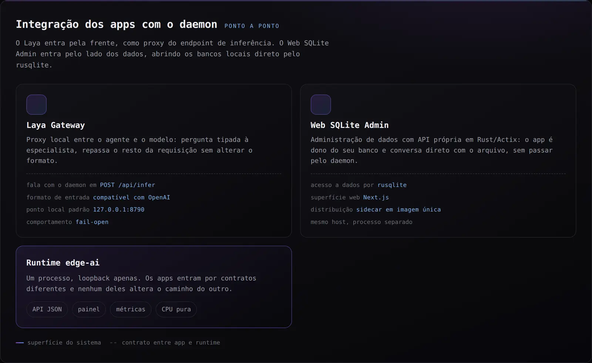
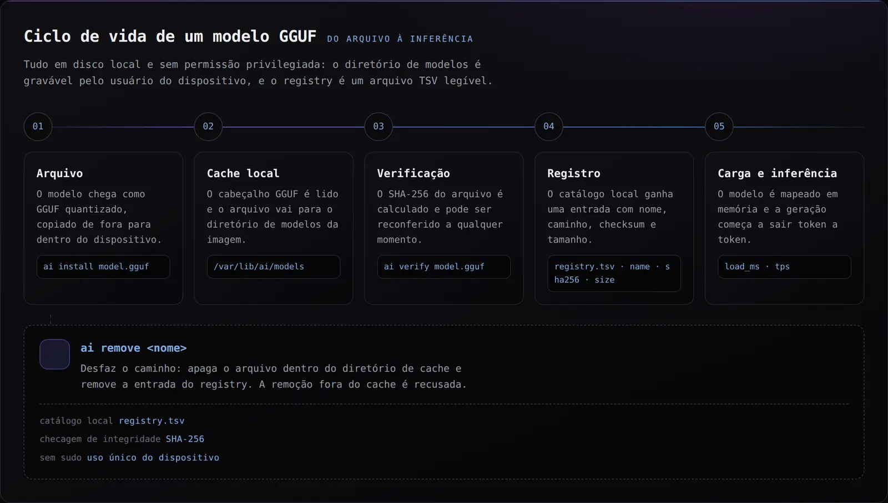

# AIOS — Arquitetura

> Status: **Rascunho baseado na auditoria** (`docs/REDOX_AUDIT.md`)
> Princípio central: **zero (ou mínimo) modificação do kernel upstream**; tudo em userspace, serviço, daemon, CLI, pacote, runtime, biblioteca ou configuração.

---

## 1. Princípios Arquiteturais

1. **Upstream-compatível**: o código preserva compatibilidade com o Redox base (kernel/userspace sem modificações), permitindo aplicar updates do upstream sem re-merges. **Projeto paralelo e privado: não há envio/contribuição de código ao Redox nem a repositórios de código fonte.**
2. **Rust-first**: todos os novos componentes são Rust.
3. **Userspace-first**: serviços e daemons antes de kernel.
4. **CPU-only inicialmente**: sem GPU/NPU até drivers existirem (auditoria: não existem).
5. **GGUF-first**: formato de modelo central.
6. **SLM-first**: modelos pequenos (100M–3B) com tarefas especializadas.
7. **Offline-first**: deletração local, cloud apenas para download/update.
8. **Isolamento real**: via `contain`/schemes — não inventar fake sandbox.
9. **Testável sem hardware**: QEMU (x86_64 + aarch64/virt + raspi3b) é o alvo de CI.
10. **Sem fake support**: um board só é "suportado" se realmente bootou com sucesso validado.

---

## 2. Visão Macroscópica



<sub>Diagrama 01 — camadas do sistema, do hardware ao token. Versão interativa: https://aios-b-612.github.io/arquitetura.html#camadas</sub>

```
                     REDOX OS  (upstream, kernel userspace)
                         │
                         ▼
                 AIOS   (novos pacotes/serviços/CLI/config)
                         │
          ┌──────────────┴──────────────┐
          │                             │
          ▼                             ▼
  Developer OS                     Edge AI OS
  (dev, compile, test)             (boot → AI service direto)
          │                             │
          └─────────────┬───────────────┘
                        │
                   AI CORE  (aios-core)
                        │
             ┌──────────┼──────────┐
             │          │          │
          Runtime    Models      Tasks
             │          │          │
             └──────────┼──────────┘
                        │
                   Edge Deploy
```

### 2.1 Componentes do runtime



<sub>Diagrama 02 — interfaces (`edge`, `ai`, `edge-sdk`, painel) → daemon `edge-ai` (`127.0.0.1:8989`) → `ai-core` e `ai-inference` → modelos GGUF. Rotas: `/api/health`, `/api/models`, `/api/infer`, `/api/benchmark`, `/api/logs`, `/api/metrics`.</sub>

### 2.2 Fluxo de uma requisição



<sub>Diagrama 03 — `POST /api/infer` → roteamento (Laya, fail-open) → resolução no registry → carga (`load_ms`) → inferência Candle CPU → resposta (`tokens`, `tps`, `load_ms`).</sub>

### 2.3 Integração dos apps próprios



<sub>Diagrama 04 — Laya Gateway entra pela frente do endpoint de inferência (formato compatível com OpenAI, fail-open); Web SQLite Admin fala com os bancos locais por `rusqlite`, em processo separado.</sub>

### 2.4 Ciclo de vida de um modelo



<sub>Diagrama 05 — `ai install <arquivo.gguf>` → cache em `/var/lib/ai/models` → SHA-256 (`ai verify`) → entrada em `/var/lib/ai/registry.tsv` → carga em memória e inferência. `ai remove <nome>` apaga o arquivo do cache e a entrada do registry.</sub>

> Os diagramas são gerados do CSS do site público (`tools/export-diagrams.py` no repositório de páginas), para que documento e site nunca divirjam. Fonte: https://aios-b-612.github.io/arquitetura.html

---

## 3. Camadas em detalhe

### 3.1 Camada base (upstream Redox)

- Kernel, relibc, RedoxFS, init (`/usr/lib/init.d/*`), networking (`smolnetd`/`dhcpd`), package (`pkgutils`/`pkgar`/`acid`), shell (`ion`), terminal, Orbital (opcional no Developer OS; **removido** no Edge OS).

### 3.2 `aios-core`

Repositório/crate central compartilhado pelos dois OS.

**Módulos** (sem dependências de UI; API independente de OS — trait-based):

- `runtime/` — abstração `AIRuntime` (trait por backend).
- `models/` — metadata, cache local, checksum.
- `registry/` — catalog de modelos + versões.
- `tasks/` — def de `AITask` (grammar, summarize, classify, embed, ...) e roteamento.
- `inference/` — execução de inferência (backend CPU).
- `benchmark/` — mede latência, tokens/s, memória.

**API pública (trait core):**

```rust
pub trait AIRuntime {
    fn name(&self) -> &'static str;
    fn load(&self, id: &ModelId, cfg: &RuntimeConfig) -> Result<Box<dyn LoadedModel>>;
    fn list_backends(&self) -> Vec<BackendInfo>;
}
pub trait LoadedModel {
    fn generate(&self, input: &[Token], params: &GenParams) -> Result<ModelOutput>;
    fn embed(&self, input: &[u8]) -> Result<Vec<f32>>;
    fn metadata(&self) -> &ModelMeta;
}
```

### 3.3 Runtimes (backends)

- `Backends contemplated`: `cpu-candle` (Candle, Rust), `cpu-ggml` (futuro), `compute-plain` (deve ser validado). O trait permite adicionar GPU/NPU no futuro.
- Disponibilidade por build: feature flags (ex.: `--features candle-cpu`).

### 3.4 Model Registry

- Formato: `ModelMeta` em TOML/JSON semelhante ao GGUF.
- Cache local: `/var/lib/ai/models` (criamos esse diretório na config do filesystem).
- Validação obrigatória: checksum, metadados, license, hardware requirements — **nunca** executar modelo sem validação.

### 3.5 Developer OS

- Base: `desktop`/`dev` config upstream + pacotes de desenvolvimento (Rust/cargo/git/rustfmt/clippy/rust-analyzer) — receitas `recipes/wip/dev/*` a avaliar para não-wip.
- Pacotes adicionais: `dev` CLI, `aios-sdk`, modelos de exemplo.
- CLI `dev` (novo crate userspace):
  - `dev new` (template de projeto com `project.toml`)
  - `dev build`, `dev run`, `dev test`, `dev check`, `dev fmt`, `dev doctor`.
- `project.toml` — ferramenta de ambiente reproduzível (toolchain, target, modelo, hardware, permissões).

### 3.6 Edge AI OS

- Base: `minimal`/`server` config upstream + **sem desktop**.
- Adiciona: `edge-ai.service` (daemon HTTP), `ai-runtime`, `model-registry`, `edge` CLI, `ai-monitor`.
- Boot mínimo: bootloader → kernel → drivers → network → storage → AI Runtime → AI API → monitoring.
- Web panel leve: HTTP server em `/` com dashboard (CPU, RAM, storage, temperature, network, models, inference, requests, latency, tokens/s, logs) — JSON API + HTML minimal.

### 3.7 Edge Deploy (no Developer OS)

- `edge devices` (registry local de dispositivos) → descoberta por mDNS/SSH (a avaliar no Redox — rede userspace limitada).
- `edge deploy model.gguf --device <id>` — validação → compat → storage → transfer → instalar → configurar → iniciar runtime → health check.
- Protocolo: inicialmente via HTTP local (a definir) dentro da rede; sem cloud.

### 3.8 SDK

- `aios-sdk` (crate Rust) expõe `ai::load`, `model.generate` para apps de borda.
- Mesma API do `aios-core`, com convenções Redox.

### 3.9 Segurança

- Modelo de permissões: `AI Permissions` (model.filesystem.read/write, model.network, model.device, model.compute).
- Implementar inicialmente aquilo que o Redox realmente suporta:
  - isolamento por `contain` (schemes);
  - schemes de usuário (`/etc/login_schemes.toml`);
  - `sudo`/userutils.
- Registrar o que ainda não é real (ex.: cgroups/namespaces estilo Linux) para não criar sandbox falsa.

---

## 4. Estrutura de Repositórios

Adaptação ao modelo real do Redox (repository-per-component + meta-repo):

```
aios/
├── platform/          → meta-repo: build, configs, CI orquestrando os demais
│   ├── config/        → perfis de imagem (ai-developer, ai-edge)
│   └── recipes/       → novas receitas (aios-core, ai-cli, dev-cli,...)
├── ai-core/           → crate aios-core (runtime/models/registry/tasks/inference/benchmark)
├── developer-os/      → tooling dev + config/templates (dev CLI, project templates)
├── edge-os/           → edge-ai.service, edge CLI, monitor, config de imagem
├── edge-sdk/          → crate aios-sdk
├── deploy/            → edge deploy protocol + device registry (Developer side)
├── tools/             → scripts auxiliares
├── tests/             → testes unitários/integração + testes de boot QEMU
├── docs/              → documentação (este conjunto)
└── scripts/           → build.sh, run-qemu.sh, test.sh, debug-qemu.sh (repo platform)
```

**Estado atual (Fase 3):** implementado no workspace `aios/` — `ai-core/` (crate aios-core: gguf, checksum, model, cache, registry, error), `edge-sdk/` (crate aios-sdk, stub), `cli/ai/` (bin `ai`), `scripts/build-redox.sh` (cross-build prefix), raiz com `Cargo.toml` (workspace), `.cargo/config.toml` (linker `x86_64-unknown-redox-gcc`). `developer-os/`, `edge-os/`, `deploy/`, `tools/`, `tests/` ainda são alvo de fases posteriores.

**Relação com o Redox base (redox-os/redox):**

- O Redox OS é a **base tecnológica** (kernel, userspace, toolchain prefix) consumida como dependência. O projeto é **paralelo e privado**: nenhum código, receita, perfil, config, pacote ou report (issues/MRs) é enviado ao Redox nem a repositórios de código fonte. Atualizações do upstream são consumidas passivamente quando necessário; qualquer correção local fica no nosso tree.

---

## 5. Mapa de Dependências

```
Developer OS (desktop)
  └─ setup: rust, cargo, git, clippy, rustfmt, rust-analyzer
  └─ aios-core (lib)
  └─ ai CLI (bin)
  └─ dev CLI (bin)
  └─ aios-sdk (lib dev)
  └─ templates (project.toml)

Edge AI OS (minimal/server + sem gui)
  └─ aios-core (lib, minimal features)
  └─ edge-ai.service (daemon)
  └─ edge CLI (bin)
  └─ ai-monitor (bin/daemon)
  └─ model-registry daemon
```

---

## 6. Fluxo de Desenvolvimento

```
develop (Developer OS)
  → cargo build (target nativo)
  → test local (QEMU x86_64)
  → edge build (para aarch64 → QEMU virt)
  → edge deploy → (Raspberry Pi, quando validado)
```

---

## 7. Feedbacks de Capacidade (bounds)

- **Modelos por RAM**: estimativas conservadoras para CPU edge:
  - Q4_K_M ≈ (params * 0.6 GB/B) + overhead. Ex.: 1B → ~0.6–0.7GB; 3B → ~1.7–2GB (excl. contexto).
  - 2GB RAM: modelos ≤ ~1B(Q4) para segurança.
  - 4GB RAM: modelos ≤ ~3B(Q4).
  - 8GB RAM: modelos ≤ ~7B(Q4) apertado, recomendado ≤ 3B confortável.
- **Tokens/s** no edge: sem benchmark comparativo Redox ainda — definiremos baseline no `ai benchmark` e publicaremos na fase 4.

---

## 8. Decisiones Firmes

1. Não tocar no kernel nos primeiros milestones.
2. GGUF é o formato nativo.
3. Candle (CPU) é o backend primário alvo; validado por build real antes de oficializá-lo.
4. Raspberry Pi real começa RPi 3B+ (boot comprovado); RPi 4/5 entram somente quando validados.
5. QEMU é o canário de boot e CI.
6. Modelos até 3B são o alvo inicial para o Edge.
7. API de IA independente de SO sempre que possível.
8. Estrutura multiplataforma, com perfil de imagem dedicado por OS.

---

*Próximo doc: `docs/ROADMAP.md`*